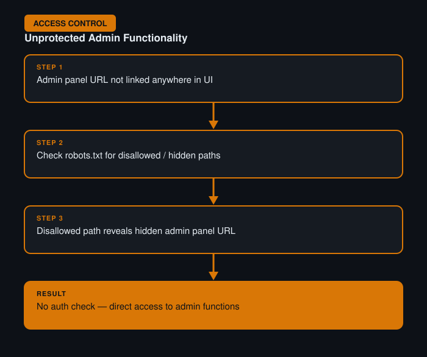

# Unprotected Admin Functionality

**Difficulty:** Apprentice
**Category:** Access Control
**Lab:** [PortSwigger — Unprotected admin functionality](https://portswigger.net/web-security/access-control/lab-unprotected-admin-functionality)

## Objective
The admin panel isn't linked anywhere in the UI, but if its URL can be found, it's accessible with no authentication check at all.

## Approach
1. Reviewed the site's page source and `robots.txt` for any hints of hidden paths.
2. Found a disallowed path in `robots.txt` pointing to an admin panel.
3. Navigated directly to that URL in the browser — no login was required, and full admin functionality (deleting users) was exposed.

## Burp Suite Usage
- **Proxy history** to review all requests made while browsing normally, looking for any static assets referencing admin routes.
- Manually checked `robots.txt` via the browser, then confirmed access directly through Burp Repeater to see the raw server response and headers.

## Remediation
- Never rely on "security through obscurity" (hiding a URL) as an access control mechanism.
- Enforce server-side authentication and role checks on every sensitive endpoint, regardless of whether it's linked in the UI.
