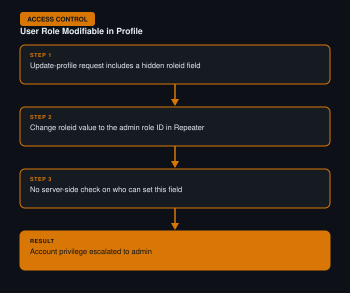

# User Role Can Be Modified in User Profile

**Difficulty:** Apprentice
**Category:** Access Control
**Lab:** [PortSwigger — User role can be modified in user profile](https://portswigger.net/web-security/access-control/lab-user-role-can-be-modified-in-user-profile)

## Objective
The user profile update endpoint accepts a role field that isn't properly restricted, allowing a normal user to elevate their own privileges.

## Approach
1. Opened the "update profile" feature and intercepted the request in Burp Proxy while submitting a normal profile change (e.g. updating an email address).
2. Noticed the request body included a `roleid` (or similarly named) field alongside the editable profile fields.
3. Sent the request to Repeater and changed the role value to the one associated with admin accounts.
4. Re-sent the request — the server accepted the change and elevated the account's privileges without any server-side check on who is allowed to set that field.

## Burp Suite Usage
- **Proxy** to capture the full profile update request body, revealing the hidden role field that isn't shown in the UI form.
- **Repeater** to tamper with the role value and confirm privilege escalation by then accessing admin-only functionality with the same session.

## Remediation
- Sensitive fields like role/permission level should never be editable through a general-purpose "update profile" endpoint.
- Enforce strict server-side allow-lists on which fields a given endpoint is permitted to modify, based on the authenticated user's current privilege level.
