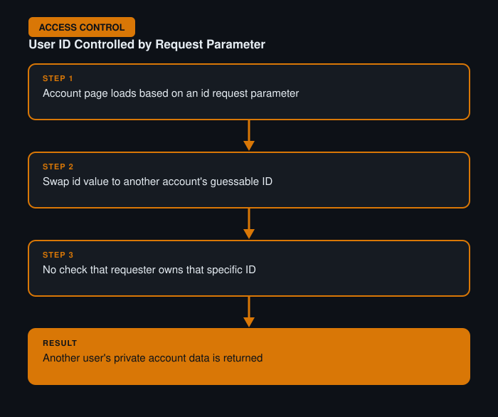

# User ID Controlled by Request Parameter

**Difficulty:** Apprentice
**Category:** Access Control
**Lab:** [PortSwigger — User ID controlled by request parameter](https://portswigger.net/web-security/access-control/lab-user-id-controlled-by-request-parameter)

## Objective
A user's account page is loaded based on a user ID passed directly in the request, with no check that the requester actually owns that ID.

## Approach
1. Logged in as a normal user and viewed the account page, noting the URL contained an `id` parameter matching the logged-in user.
2. Sent the request to Burp Repeater and changed the `id` value to a different, guessable value (e.g. `id=carlos`, a common target account in these labs).
3. The server returned another user's account information without validating that the current session was authorized to view that specific ID.

## Burp Suite Usage
- **Repeater** to swap the ID parameter and immediately observe the response, comparing account details returned each time.

## Remediation
- Every request for a specific resource must verify server-side that the *authenticated* user is actually permitted to access that specific resource ID, not just that they are logged in.
- Avoid using guessable, sequential, or otherwise predictable identifiers for sensitive resources where possible.
