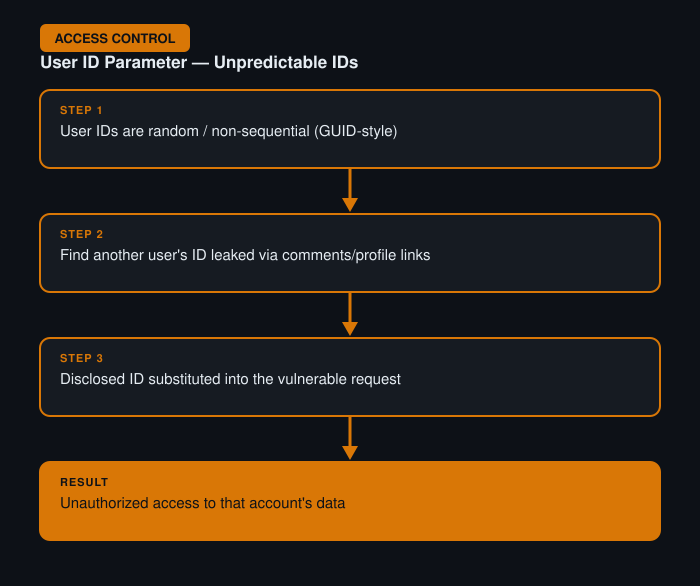

# User ID Controlled by Request Parameter, with Unpredictable User IDs

**Difficulty:** Apprentice
**Category:** Access Control
**Lab:** [PortSwigger — User ID controlled by request parameter, with unpredictable user IDs](https://portswigger.net/web-security/access-control/lab-user-id-controlled-by-request-parameter-with-unpredictable-user-ids)

## Objective
Similar to the previous lab, but the user IDs are non-sequential/random (e.g. GUID-style), so they can't simply be guessed or incremented.

## Approach
1. Reasoned that if IDs can't be guessed directly, they're likely disclosed somewhere else in the application, such as within page content, comments, or API responses that reference other users.
2. Browsed the application looking for any feature that displays other users' identifiers indirectly — for example, a blog comment section showing a "view profile" link containing another user's actual ID.
3. Captured that ID from the page/response in Burp Proxy, then substituted it into the account request via Repeater.
4. Successfully accessed another user's account data using the disclosed ID.

## Burp Suite Usage
- **Proxy history** to scan through previously loaded pages/responses for leaked identifiers rather than trying to brute-force an unguessable value.
- **Repeater** to substitute the discovered ID into the vulnerable request.

## Remediation
- Unpredictable identifiers reduce the *risk* of enumeration but do not replace proper authorization checks.
- Ensure that even a correctly-guessed or discovered ID cannot be used to access data unless the requesting user is explicitly authorized for that resource.
