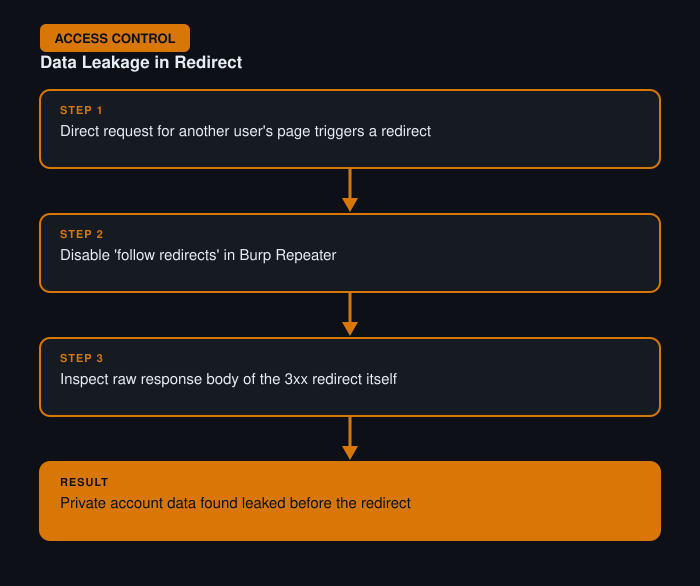

# User ID Controlled by Request Parameter with Data Leakage in Redirect

**Difficulty:** Apprentice
**Category:** Access Control
**Lab:** [PortSwigger — User ID controlled by request parameter with data leakage in redirect](https://portswigger.net/web-security/access-control/lab-user-id-controlled-by-request-parameter-with-data-leakage-in-redirect)

## Objective
The application appears to correctly block direct access to another user's account (redirecting unauthorized requests), but sensitive data is still leaked in the body of the redirect response itself before the redirect takes effect.

## Approach
1. Requested another user's account page directly by changing the ID parameter, similar to the earlier labs.
2. Observed that the browser correctly followed a redirect away from the page — but noted this behavior in Burp Proxy, where redirects can be inspected *before* the client follows them.
3. Turned off automatic redirect-following in Burp and re-sent the request via Repeater, examining the raw HTTP response body of the 3xx redirect response itself.
4. Found that the response body (which browsers normally discard immediately) still contained the target user's private account information, disclosed before the redirect was even followed.

## Burp Suite Usage
- **Repeater**, with "follow redirects" disabled, to capture and inspect the raw response body of the redirect rather than letting the client silently move past it.

## Remediation
- Access control checks must prevent sensitive data from ever being included in a response, not just prevent the client from *displaying* it.
- If a request is unauthorized, the server should return an empty/generic response alongside the redirect, never the protected data itself.
