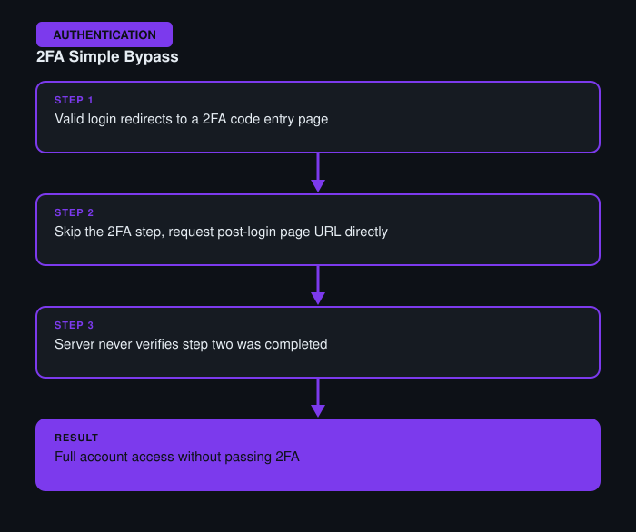

# 2FA Simple Bypass

**Difficulty:** Apprentice
**Category:** Authentication
**Lab:** [PortSwigger — 2FA simple bypass](https://portswigger.net/web-security/authentication/multi-factor/lab-2fa-simple-bypass)

## Objective
After entering valid credentials, the application redirects the user to a second-factor verification page — but the page after 2FA can be accessed directly without actually completing that step.

## Approach
1. Logged in with valid credentials and observed the app redirect to a `/login2` (2FA code entry) page.
2. Instead of submitting a 2FA code, manually navigated directly to the URL of the post-login "my account" page that should only be reachable after completing 2FA.
3. The server granted access to the account page anyway, since it only checked that the user had passed step one (username/password) and never verified step two had actually been completed for that session.

## Burp Suite Usage
- **Proxy** to observe the exact sequence of requests during a normal login (credentials → 2FA prompt → account page), identifying which URL was reachable prematurely.
- **Repeater** to directly replay a request for the protected account page using the session cookie obtained after step one only.

## Remediation
- Server-side session state must track whether each authentication factor has actually been completed, and every protected endpoint must check that the *full* authentication flow — not just the first factor — has been satisfied.
- Never assume a multi-step flow was followed correctly just because the client was redirected to the next step.
