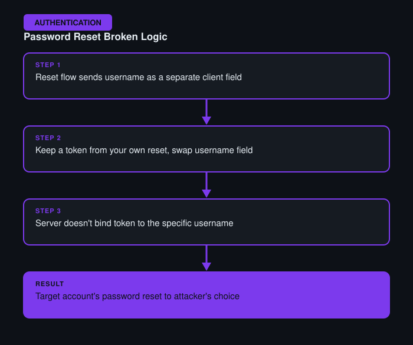

# Password Reset Broken Logic

**Difficulty:** Apprentice
**Category:** Authentication
**Lab:** [PortSwigger — Password reset broken logic](https://portswigger.net/web-security/authentication/other-mechanisms/lab-password-reset-broken-logic)

## Objective
The password reset flow includes a step where the username the reset applies to is passed as a hidden, client-controlled parameter rather than being tied server-side to the token that was emailed.

## Approach
1. Walked through the password reset flow as a normal user (requesting a reset, receiving a token, submitting a new password) to understand the request structure.
2. Intercepted the final "set new password" request in Burp Proxy and noticed it included a `username` parameter alongside the reset token and new password fields.
3. Sent the request to Repeater and changed the `username` value to a different account (e.g. the admin account), while keeping a token obtained from a reset request made against the attacker's own account.
4. The server accepted the mismatched token/username pair and updated the *target* account's password instead of validating that the token was actually issued for that specific username.

## Burp Suite Usage
- **Proxy** to capture the multi-step reset flow end-to-end and identify every parameter being sent, including ones not reflected in the visible form.
- **Repeater** to swap the username field independently of the token, testing whether the two were properly bound together server-side.

## Remediation
- Password reset tokens must be cryptographically bound to a specific account server-side; the username must never be re-suppliable by the client at the final reset step.
- Invalidate tokens immediately after single use and expire them after a short time window.
