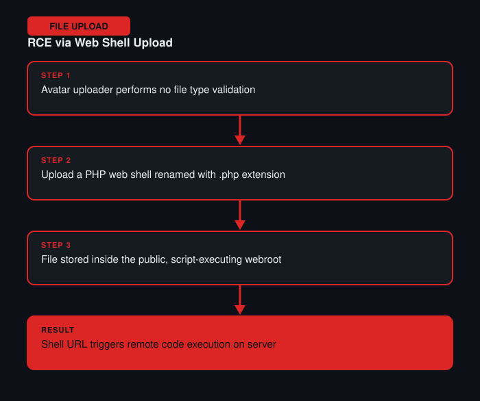

# Remote Code Execution via Web Shell Upload

**Difficulty:** Apprentice
**Category:** File Upload
**Lab:** [PortSwigger — Remote code execution via web shell upload](https://portswigger.net/web-security/file-upload/lab-file-upload-remote-code-execution-via-web-shell-upload)

## Objective
The file upload feature (an avatar/profile picture uploader) performs no validation at all on the uploaded file type, allowing a server-side script to be uploaded and executed directly.

## Approach
1. Uploaded a normal image first to observe where uploaded files are stored and how they're served back (the URL pattern for uploaded avatars).
2. Crafted a minimal PHP web shell (a script accepting a command via a query parameter and executing it) and renamed it with a `.php` extension.
3. Intercepted the upload request in Burp Proxy and forwarded the file through as-is, since no server-side check blocked the extension.
4. Navigated to the uploaded file's URL directly and appended a command parameter, confirming code execution on the server.

## Burp Suite Usage
- **Proxy** to capture and inspect the multipart form upload request, confirming exactly which fields (filename, Content-Type) the server relied on.
- **Repeater** to resend the upload with tweaks and to trigger the shell afterward via a simple GET request.

## Remediation
- Never allow uploaded files to be stored in, or served from, a location where the server will execute them (e.g. a public web root with script execution enabled).
- Validate file type using content inspection (magic bytes), not just the file extension or client-supplied Content-Type.
- Store uploads outside the webroot, or serve them with a `Content-Disposition: attachment` header so they are downloaded rather than executed.
