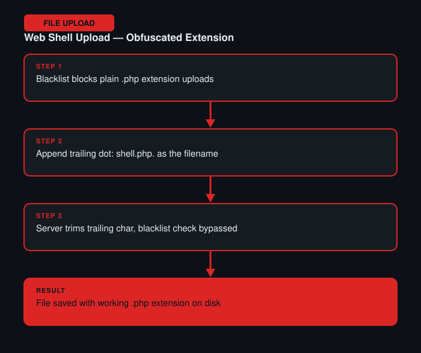

# Web Shell Upload via Obfuscated File Extension

**Difficulty:** Practitioner
**Category:** File Upload
**Lab:** [PortSwigger — Web shell upload via obfuscated file extension](https://portswigger.net/web-security/file-upload/lab-file-upload-web-shell-upload-via-obfuscated-file-extension)

## Objective
The application blocks common dangerous extensions (like `.php`) via a blacklist, but the blacklist logic can be defeated with extension obfuscation tricks.

## Approach
1. Tried a plain `.php` extension first — blocked by the blacklist as expected.
2. Tried common blacklist-bypass tricks (double extensions, case variation) — some were blocked, indicating a partially case-insensitive or multi-pattern blacklist.
3. Tested appending a trailing dot or space after the extension (e.g. `shell.php.`), a technique that works against certain file systems/frameworks which strip trailing characters when saving the file, leaving the executable extension intact once written to disk.
4. Sent the crafted filename through Burp Repeater in the multipart upload request and confirmed the file was stored and accessible with a working `.php` extension once trailing characters were stripped server-side.

## Burp Suite Usage
- **Repeater** to rapidly test multiple filename obfuscation variants against the same upload endpoint, one field change at a time.
- **Proxy history** to compare server responses (accepted vs rejected) across each attempt.

## Remediation
- Avoid blacklist-based extension filtering entirely — use a strict allow-list of permitted extensions.
- Normalize/canonicalize filenames server-side (trim whitespace, resolve trailing dots) *before* the extension check is applied, not after.
