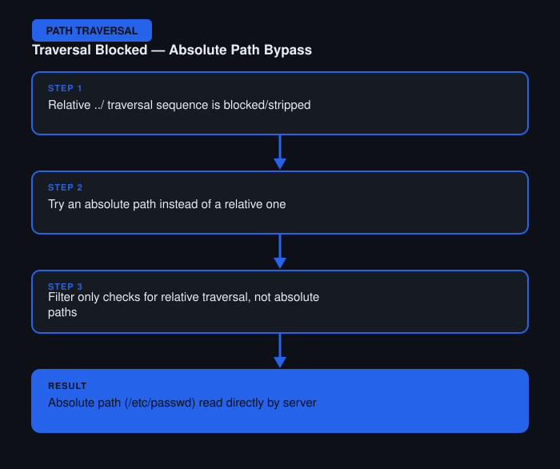

# File Path Traversal — Traversal Sequences Blocked with Absolute Path Bypass

**Difficulty:** Practitioner
**Category:** Path Traversal
**Lab:** [PortSwigger — Traversal sequences blocked with absolute path bypass](https://portswigger.net/web-security/file-path-traversal/lab-absolute-path-bypass)

## Objective
The application blocks traversal sequences like `../` but still allows absolute file paths to be passed directly.

## Approach
1. Attempted the standard `../../../etc/passwd` payload first — this was blocked/stripped by the app's filter.
2. Reasoned that if the filter only targets relative traversal sequences, an absolute path might not trigger the same check.
3. In Burp Repeater, replaced the payload with an absolute path (`/etc/passwd`) directly as the filename value.
4. The server passed this straight to the file system read function without validating that it stayed within the intended directory, returning the file contents.

## Burp Suite Usage
- **Repeater** to quickly test both the relative traversal payload and the absolute path variant against the same request.
- Compared response length/status to confirm which payload actually worked.

## Remediation
- Filtering `../` sequences is not sufficient on its own — validate that the final resolved path is a *child* of the expected directory, regardless of how it was constructed.
- Reject any input that resembles an absolute path outright when a relative filename is expected.
