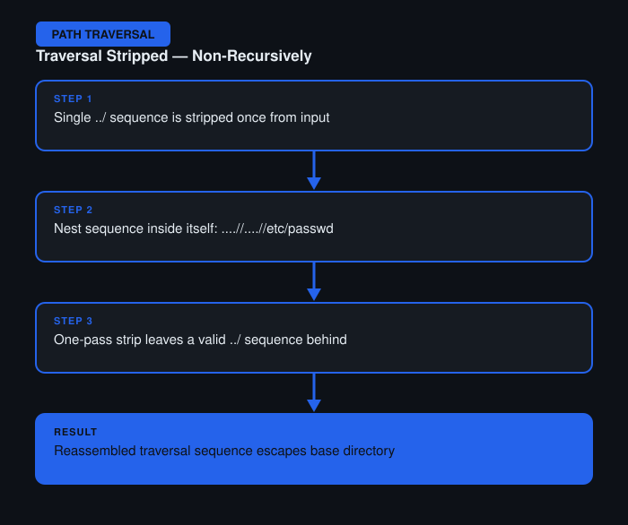

# File Path Traversal — Traversal Sequences Stripped Non-Recursively

**Difficulty:** Practitioner
**Category:** Path Traversal
**Lab:** [PortSwigger — Traversal sequences stripped non-recursively](https://portswigger.net/web-security/file-path-traversal/lab-superfluous-non-recursive-path-removal)

## Objective
The app strips `../` sequences from input, but only performs the removal once rather than recursively.

## Approach
1. Sent a standard `../` payload — it was stripped, and the request resolved to the base directory instead of traversing out.
2. Reasoned that a single, non-recursive strip could be defeated by nesting the sequence inside itself, so that after one round of stripping, a valid traversal sequence remains.
3. Crafted a payload like `....//....//....//etc/passwd` — when the filter removes the inner `../`, what's left reassembles into a working traversal sequence.
4. Re-sent via Burp Repeater and confirmed the file was disclosed.

## Burp Suite Usage
- **Repeater** for fast iteration on the nested payload structure, tweaking the number of repeated characters until the resulting stripped string produced a valid path.

## Remediation
- Strip traversal sequences in a loop until no more changes occur, or better, avoid string-manipulation-based sanitization entirely.
- Canonicalize the path first, then check it against the expected base directory.
