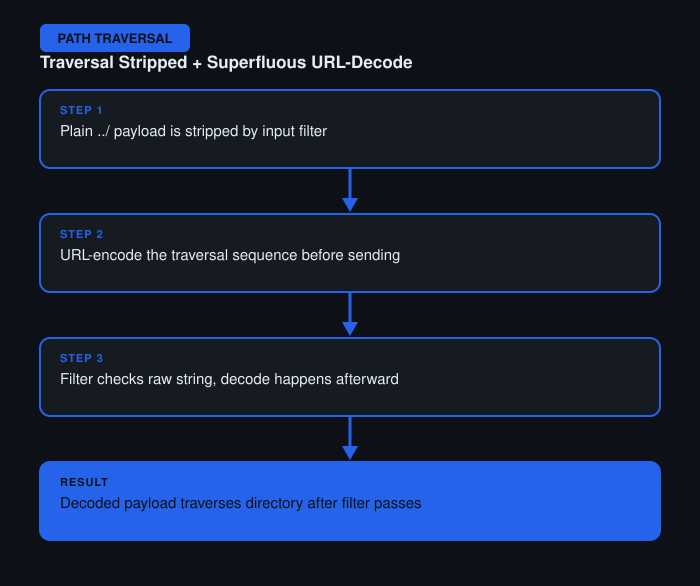

# File Path Traversal — Traversal Sequences Stripped with Superfluous URL-Decode

**Difficulty:** Practitioner
**Category:** Path Traversal
**Lab:** [PortSwigger — Traversal sequences stripped with superfluous URL-decode](https://portswigger.net/web-security/file-path-traversal/lab-superfluous-url-decode)

## Objective
The application strips traversal sequences from the input, but then performs a second, unnecessary URL-decode pass afterward — reintroducing a way to sneak past the filter.

## Approach
1. Sent a plain `../` payload — stripped by the filter as expected.
2. Considered that if the app decodes the input *after* filtering, a URL-encoded traversal sequence would pass the filter as harmless-looking text, then get decoded into a working payload afterward.
3. URL-encoded the traversal sequence (`..%252f` style double-encoding, decoding to `../` only after the filter's check) and sent it through Burp Repeater.
4. Confirmed the file was returned, proving the decode-after-filter order was the flaw.

## Burp Suite Usage
- **Repeater** to test various encoding levels (single vs double URL-encoding) against the input field.
- **Inspector panel** in Repeater to double check how Burp itself was encoding characters before send, to avoid double-encoding by accident.

## Remediation
- Perform all decoding *before* any security filtering, never after.
- Validate and canonicalize the final decoded path, not the raw input string.
