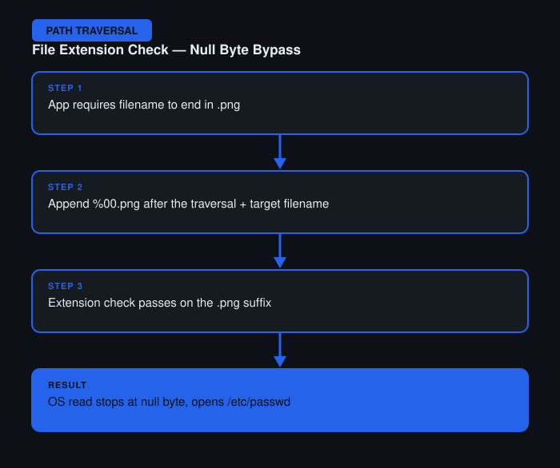

# File Path Traversal — Validation of File Extension with Null Byte Bypass

**Difficulty:** Practitioner
**Category:** Path Traversal
**Lab:** [PortSwigger — File path traversal, validation of file extension with null byte bypass](https://portswigger.net/web-security/file-path-traversal/lab-validate-file-extension-null-byte)

## Objective
The app requires the requested filename to end in `.png`, intending to restrict access to image files only.

## Approach
1. Attempted a traversal payload appended with `.png` at the end to satisfy the extension check — the file was read but effectively treated as an image lookup, not returning arbitrary file content usefully.
2. Reasoned that many underlying file-handling libraries treat a null byte as a string terminator, so appending a null byte before the required extension might cause the extension check to pass while the actual file read stops at the null byte.
3. Crafted a payload like `../../../etc/passwd%00.png` — the app's extension check saw `.png` at the end and approved it, while the OS-level file read terminated at the null byte and opened `/etc/passwd`.
4. Verified via Burp Repeater that the file content was returned.

## Burp Suite Usage
- **Repeater** to test the raw payload with the encoded null byte (`%00`), since browsers/URL bars can mangle these characters.

## Remediation
- Never rely solely on extension suffix checks for validation.
- Reject null bytes and other control characters in file path input entirely.
- Validate the resolved canonical path against an allow-list rather than pattern-matching the string.
